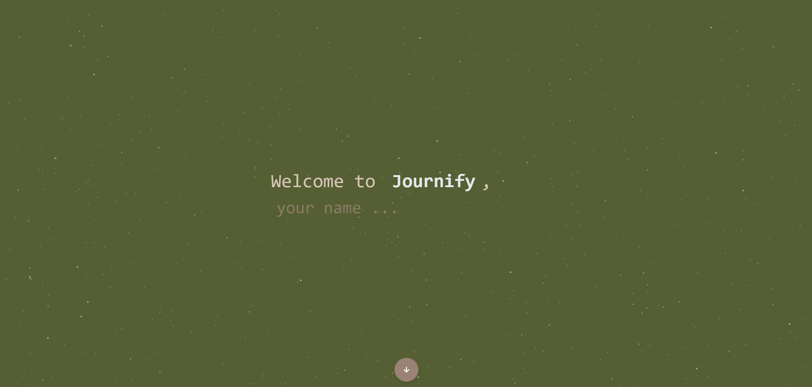
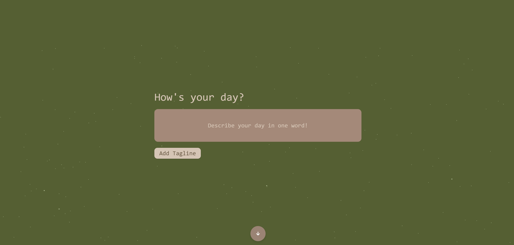
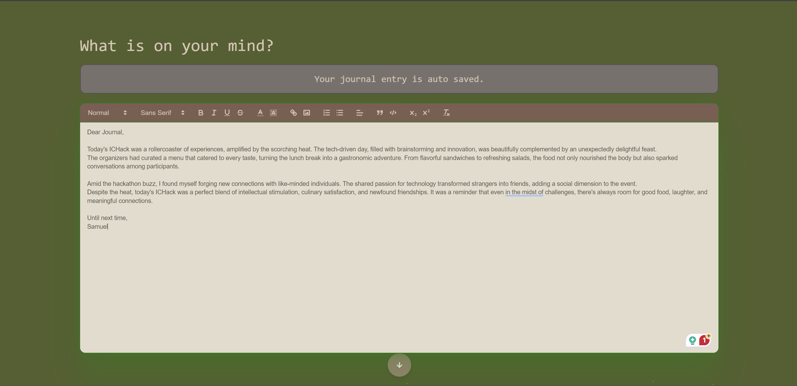
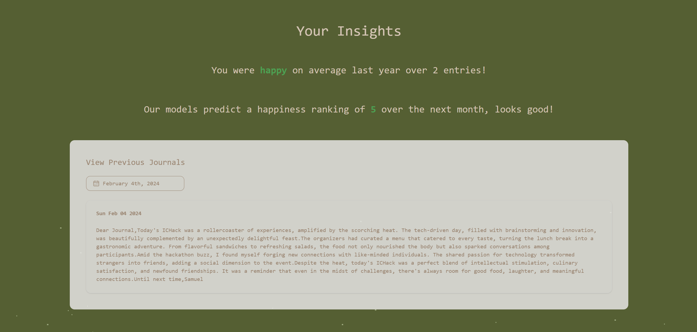
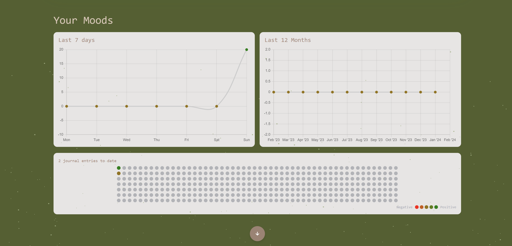

# Journify

> **Our Inspiration**  
Everyone needs an outlet, whether it is the child returning from school, a busy adult after a long day of work, or a retiree resting on a rocking chair. We all need a way to wind down. This is especially true for those suffering from extreme mental stress, where their circumstances often overpower their own need and their inner voice gets repetitively ignored. To address this, we propose an age-old idea—writing a journal. Though simplistic, reflecting on the day and processing how certain actions impact us (instead of suppressing them) is a powerful method of relief that has time and time again affirmed its continuity.

Journify is our modern take on a journal that aims to build this into a lifelong habit. For those in volatile environments, the contrasting stability of routine often brings a sense of calmness and peace.

<details>
<summary>What is Journify?</summary>
Journify is a web app that combines the benefits of journaling with the accessibility of devices and the power of semantic analysis. With a minimal, ergonomic UI and a calming pastel color palette, it creates a welcoming environment for users to express their thoughts.

Features include a mood tracker, journal history log, and predictive happiness score, helping users track their emotions and well-being over time. The journal timeline feature encourages regular use by displaying ongoing streaks.
</details>

<details>
<summary>How did we build it?</summary>
We leveraged our front-end development experience, using TypeScript with Next.js and Tailwind for their popularity and support. We divided tasks based on individual strengths and used git branches with defined objectives to ensure efficient development.
</details>

<details>
<summary>Challenges we ran into</summary>
Initially, we considered integrating the Spotify API for mood-based song recommendations and extensive NLP for mood detection. However, due to limited time and manpower, we refined our requirements to focus on essential features that stand out and leave room for future enhancements.
</details>

<details>
<summary>Accomplishments that we're proud of</summary>
For a two-person team, we're proud of our product. We aimed to design a simplistic, aesthetic interface easy for beginners to navigate. Highlights include the journal timeline (inspired by GitHub activity) and the search functionality, complemented by semantic analysis.
</details>

<details>
<summary>What we learned</summary>
Building Journify was an invaluable experience, enhancing our skills with Next.js, Tailwind, pair programming, and ergonomic UI design. It also improved our project management abilities by setting realistic deadlines and focusing on user-centric features.
</details>

<details>
<summary>What's next for Journify!</summary>
We have several ideas for future enhancements, including an NLP-based “montage” feature to summarize users’ past weeks or months. This will help users appreciate the present and reflect on their experiences. So, why not start your jour-ney with Jour-nify?
</details>

### Journify In Action
A quick look into what Journify looks like and its core features!

  
  
  
  


## Getting Started
First, run the development server:

```bash
npm run dev
# or
yarn dev
# or
pnpm dev
# or
bun dev
